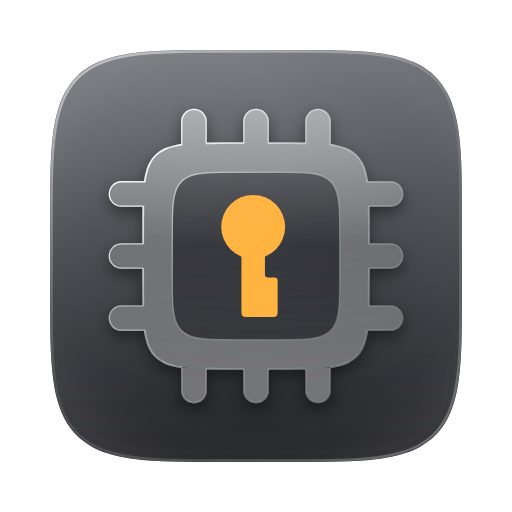
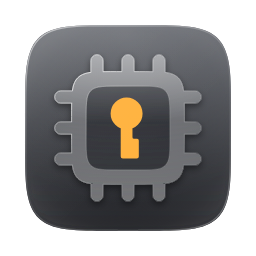

<div align="center">



# macop icon &amp; brand

**Enclave** — an Apple-silicon die holding a warded keyway, seen through smoked glass.


</div>

---

macop's differentiator is not that it is another password manager. It is that
secrets are **bound to Apple hardware**: Keychain references resolved at the
process boundary, Secure Enclave-backed SSH identities, no private key ever
written to a file. The mark says exactly that.

| element | meaning |
| --- | --- |
| squircle die and twelve pins | Apple silicon — where the secret lives |
| the keyway at the centre | the secret itself, in the one warm colour |
| the die holds only the keyway | nothing is exported; the key never leaves |
| space grey, aluminium, system orange | the language of the hardware, without Apple's logo |

The keyhole is a **warded keyway**, not a plain slot. That stepped cross-section
is what makes a lock accept exactly one key — the same claim as "this Mac's
Secure Enclave and no other". The asymmetry earns its keep twice: a circle over
a symmetric flare reads as a head over shoulders no matter how it is
proportioned, and a step in the ward kills that reading outright.

---

## Assets

```
svg/macop-icon.svg              app icon, 1024, with the field
svg/macop-mark.svg              mark alone, colour, transparent
svg/macop-mark-mono.svg         mark alone, single colour (currentColor)
svg/macop-wordmark.svg          the wordmark
svg/macop-lockup.svg            horizontal lockup
svg/macop-lockup-stacked.svg    stacked lockup
png/                            PNG exports, 1024 down to 16
png/themes/spacegrey-256.png    neutral field sample
../../Resources/MacopAuth/MacopAuth.iconset/   the shipped app icon
```

`macop-mark-mono.svg`, `macop-wordmark.svg` and both lockups use `currentColor`,
so CSS `color` or SwiftUI `.foregroundStyle` flips them between light and dark.
Only the keyway is fixed.

### Where each one goes

| context | asset |
| --- | --- |
| app icon, Dock, `MacopAuth.app` | `MacopAuth.icns`, built from the iconset |
| menu bar / status item | `macop-mark-mono.svg` as an `NSImage` with `isTemplate = true` |
| README and site headers | `macop-lockup.svg` |
| square slots — org avatars, social | `macop-lockup-stacked.svg` or the icon |
| very small list rows | the mono mark, not the icon |

Clear space: one pin's length — about 11% of the mark's height — from the pin
tips outward.

---

## Neutral field

<div align="center"></div>

The public build uses one original neutral `spacegrey` field and no third-party
artwork. The die and keyway are the identity and never change.

```bash
./export.sh
```

---

## Regenerating

Everything is generated. No font dependency, no binary source of truth: the
wordmark is drawn as monoline geometry from arcs and lines, so there is no font
licence to honour and no outline to re-trace.

```bash
npm ci                          # install the pinned renderer
npm run install-browser         # install the matching Chromium build
./export.sh                     # SVGs, PNGs, the app's .iconset, then the contrast gate
node check-contrast.js          # the gate on its own
```

`build.py` is the single source of shape. Change a constant — `RING_W`, the
`KEY_*` ward, the wordmark's `X_HEIGHT` / `STROKE` / `LX` — and every asset
follows. `raster.js` drives the local Chromium; one browser launch renders the
whole set.

The `.icns` is assembled on macOS by `scripts/build-auth-app.sh`, which runs
`iconutil` over the iconset at build time. `iconutil` has no Linux equivalent, so
the repository carries the PNG slots — each rendered from the vector at its own
size, never upscaled — rather than a binary `.icns`.

---

## The two invariants

The die face is translucent, so a palette edit can quietly make the mark
unreadable. `check-contrast.js` runs at the end of every export, renders the
neutral field into a canvas and reads real pixels:

| measure | what | target |
| --- | --- | --- |
| `keyway` | the keyway against the window behind it | 5.5:1 |
| `die` | the die wall against the sky beside it | 1.75:1 |

Both have caught regressions that were invisible by eye. Keep the measured
thresholds when changing the neutral palette.

---

## Palette

| role | value |
| --- | --- |
| Sky | `#55585F` → `#1F2024` |
| Aluminium (die wall, pins) | `#FFFFFF` → `#F4F7FC` → `#CFD7E4` → `#A6B0C2` → `#C7CFDC` |
| Die glass (the window) | `#0B0D12`, opacity `0.40` |
| Wall glass | white tint, opacity `0.46` |
| System orange (keyway) | `#FFB340` → `#FF9500` |
| Ink (marks on light) | `#1D1D1F` |

The aluminium gradient's last stop is a bounce light. Without it the die reads
as paper rather than metal.

---

## What stays out

Apple's logo and the bitten-apple silhouette are not used. Putting them in a
third-party product's logo is prohibited by Apple's guidelines and is a
trademark risk. The Apple-ness here is structural instead — continuous-curvature
squircles rather than rounded rectangles, anodised space grey, a real aluminium
gradient, macOS system orange, and the layered shadow that seats the die on the
field.

macop is an independent project and is not affiliated with or endorsed by
Apple Inc. Apple and macOS are trademarks of Apple Inc.
