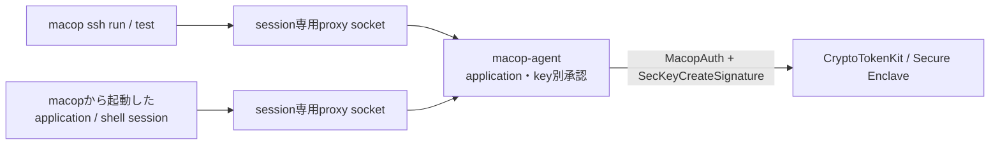
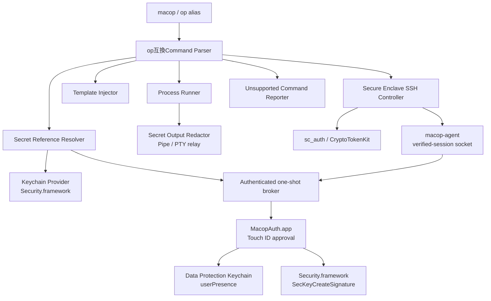

# macop Design Document

Status: Draft
Last updated: 2026-08-28

> **Phase 0 update (2026-08-14):** CTK identityをApple純正`ssh-keychain.dylib`から直接利用できるため、「macop-agentだけが署名できる」という排他性は不採用とする。共用socketから元applicationを推定する方式も採用しない。一方、Phase 0bでapplication別の短命socket、起動PID・code identity・process ancestry、OpenSSH session bindingを組み合わせるverified-session agentが条件付きで成立することを実機確認した。nonceはrootから観測できる証拠ではなく、launcher/registry内のopaque reservation capabilityに限定する。Section 9.3–9.4と[feasibility report](./macop-phase0-feasibility-2026-08-14.md)が、本文中の競合する旧記述より優先する。

> **Dogfood update (2026-08-28):** 現行macOSでは作成済みCTK identityを`ssh-keychain.dylib`が列挙できなかったため、現行実装は同dylibへ依存しない。公開鍵はSecurity.frameworkで解決し、`ssh test/run`は要求ごとのverified-session agentを介して署名する。Phase 0記録のdylib記述は脅威境界を定めた当時の調査結果としてのみ残す。

## 1. 概要

`macop`は、macOSのApple純正セキュリティ機能を、1Password CLI (`op`) に近い操作感で利用するためのCLIである。

利用者が`macop`を`op`にエイリアスすると、対応済みの`op`コマンドを同じ構文で実行できる。対応していない1Password固有機能は暗黙に無視せず、未対応理由を含むエラーを返す。

```zsh
alias op=macop

op read 'op://Local/GitHub/token'
op run --env-file=.env -- gh api user
op inject -i config.tpl
op item list
```

## 2. 背景と目的

### 2.1 背景

- CLIで利用するパスワード、API token、SSH秘密鍵を通常ファイルへ保存したくない。
- 1Password CLIの`read`、`run`、`inject`、SSH Agent相当の使用感が必要。
- 独自vaultや独自の暗号化ストレージは作らない。
- Apple純正のKeychain、CryptoTokenKit、Secure Enclaveを優先して利用する。

### 2.2 目的

- secretを`~/.ssh`、`.env`、設定ファイル、自前DB、一時ファイルへ永続化しない。
- secretを必要な瞬間だけ取得し、対象プロセスまたは署名処理へ渡す。
- SSH秘密鍵をファイルへ出さず、Secure Enclave内で署名する。
- 既存の`op`向けスクリプトを、可能な範囲で変更せず実行できるようにする。
- 未対応操作を明確かつ機械判定可能なエラーとして返す。

## 3. 用語上の「端末に置かない」

本設計における「端末にセキュアな情報を置かない」は、secretを通常ファイルシステムや`macop`独自ストレージへ保存しないことを意味する。

以下は利用を許可する。

- macOS Keychain
- Data Protection Keychainのうち`macop`にアクセス権がある項目
- CryptoTokenKit
- Secure Enclave
- 子プロセスの実行中メモリ
- SSH wrapperが実行中だけ保持する非機密のprocess state

以下は禁止する。

- `~/.ssh`にある秘密鍵ファイル
- secretを含む`.env`や設定ファイル
- secretを含む一時ファイル
- `macop`独自vault・DB
- secretの永続キャッシュ
- secretをプロセス引数へ埋め込む実行方法

ラベル、公開鍵、公開鍵ハッシュ、provider名、secret参照URIなどの非機密メタデータは設定ファイルへ保存できる。

## 4. スコープ

### 4.1 MVP

- `macop`と`op`互換エントリポイント
- secret referenceの解析
- `read`
- `run`
- `inject`
- `item list`
- `item get`
- `run`のstdout/stderrに対するデフォルトsecretマスクと`--no-masking`
- 通常Keychainのgeneric password / internet password参照
- Secure Enclave SSH鍵の作成、一覧、公開鍵取得、利用、削除
- Secure Enclave SSHの安全なwrapper（backendと保証範囲はPhase 0結果を受けSection 9.4で再設計）
- JSON出力
- shell completion
- `--help`、`--version`、`--format`、`--config`、`--no-color`、secretを出さない`--debug`
- 環境診断 (`doctor`)
- `macop`固有の`ssh`、`config`、`compatibility` command
- 未対応コマンドの構造化エラー
- UTF-8 text secretだけを扱う（binary secretとNULを含む値は拒否する）
- `op run`の対話実行と、login session中に常駐して短命なsession専用socketを仲介するSSH agent service

### 4.2 MVP対象外

- Apple Passwordsアプリ内のpassword、OTP、passkeyの取得
- `op read`によるOTP取得、SSH秘密鍵のOpenSSH形式export
- Keychain itemの作成、編集、削除
- 独自vault
- cloud backend
- 複数端末でのSecure Enclave秘密鍵同期
- service account / CI
- user / group / vault権限管理
- Document保管
- secret共有リンク
- Secure Enclave秘密鍵のexport
- 任意の対話プロンプトへの自動入力

## 5. Apple Passwordsの扱い

Apple Passwordsアプリの項目には、第三者CLIが継続的に参照できる公開APIがない。Keychain Servicesはaccess groupでアクセスが制限されるため、`macop`からApple Passwords固有のaccess groupを読むことはできない。

本プロジェクトでは`apw`を利用しない。また、`apw`相当のheadless browser・ブラウザ拡張ブリッジもMVPには実装しない。

そのため、Apple Passwordsを参照しようとした場合は明示的な未対応エラーを返す。

```console
$ macop read 'apple-passwords://github.com/me/password'
macop: unsupported provider "apple-passwords"
Apple Passwords does not expose a public CLI/API for live credential access.
This build does not use apw or a browser-extension bridge.
exit status: 3
```

Appleが将来公式APIを公開した場合は、providerとして追加する。

## 6. `op`互換モード

### 6.1 起動方法

推奨方法はshell aliasとする。

```zsh
alias op=macop
eval "$(macop completion zsh)"
```

生成したZsh completionは`macop`と`op`の両方へ登録する。`macop`は自身が`macop`または`op`のどちらとして起動された場合も同じコマンドツリーを提供する。実体が既存1Password CLIかどうかに依存するfallbackは行わない。

shell aliasは対話shellだけに適用され、通常のshell scriptでは展開されない。既存scriptを無変更で動かす導入では、`macop` binaryへの`op` symlinkを`$PATH`上に置く。aliasは日常利用向け、symlinkはscript互換向けとする。

### 6.2 互換性方針

- 対応コマンドは可能な限り`op`と同じ引数・flagを受け付ける。
- secret referenceは`op://<namespace>/<item>/[<section>/]<field>`形式を受け付ける。
- `--format=json`、`--no-color`、`--config`など、既存スクリプトで使われるflagを優先する。
- 完全互換を装わない。
- 未対応コマンド、flag、providerは必ず非ゼロで終了する。
- 未対応操作を成功扱いにしたり、入力を無視したりしない。
- 意味が異なるcommandやflagを互換と見なさない。たとえば1Password accountを返す`whoami`はローカルmacOS user情報で代用しない。
- 本物の`op`へ暗黙に処理を転送しない。

`ssh`、`config`、`doctor`、`compatibility`と`item import/acquire/create/edit/delete`は`macop`固有のextensionであり、1Password CLI互換とは主張しない。alias経由で`op ssh`などと起動された場合も、`macop` extensionとして同じ動作をする。

### 6.3 互換対象

| 1Password CLI | macop | MVP |
| --- | --- | --- |
| `op --help`, `--version`, `--format`, `--no-color`, `--debug`, `--config` | 同名 | 対応。`--debug`でもsecretはredactする |
| `op read` | `macop read` | 対応: text field、`--no-newline`。`--out-file`、OTP、SSH private key exportは未対応 |
| `op run` | `macop run` | 対応: shell/env-file、複数`--env-file`、デフォルトmask、`--no-masking`。1Password Environmentsは未対応 |
| `op inject` | `macop inject` | 対応: stdin / `--in-file`、reference置換、stdout出力。`--out-file`は未対応 |
| `op item list` | `macop item list` | 部分対応: config登録済みitemのみ、`--long`と`--format=json` |
| `op item get` | `macop item get` | 部分対応: item名、`--fields label=…`、`--reveal`、`--format=json`。ID、stdin、OTP、share linkは未対応 |
| `op completion` | `macop completion` | 対応: bash / zsh / fish。PowerShellはmacOS MVP外 |
| `op whoami` | 同名 | 未対応。1Password accountという概念がないため |
| `op signin`, `op signout`, `op update` | 同名 | 未対応。account backend・自動updateを持たないため |
| `op item create/edit/delete` | `macop item create/edit/delete` | macop extensionとして設定済みKeychain selectorに限定対応。1Password item schema互換ではない |
| `op item move/share/template` | 同名 | 未対応。vault/share/templateのデータモデルを持たないため |
| `op vault/account/user/group/service-account/connect/events-api/document/environment/plugin` | 同名 | 未対応。vault/cloud backendを持たないため |
| `--account`, `--session`, `--cache`, `--iso-timestamps`、UTF-8以外の`--encoding` | 同名 | 未対応。無視やno-opにはしない |
| — | `macop ssh`, `config`, `doctor`, `compatibility`, `item import/acquire/create/edit/delete` | macop extensionとして対応。1Password CLI互換の機能ではない |

### 6.4 互換性の境界

`item list/get --format=json`はJSONを返すが、1Password item JSONの完全なschema互換ではない。`id`、`vault`、category、tag、archive、share linkのデータモデルが存在しないため、出力は`macop` schema versionを持つmetadataに限る。1Password JSONを前提に`jq`で`.vault.id`などを読むscriptは未対応として扱う。

`run --env-file`は標準的なdotenvの`KEY=VALUE`、comment、quoteを扱う。1Password Environments、vault/accountを伴う優先順位、dotenv固有の未定義variable展開は未対応エラーにする。global flagはcommandの前後どちらに置いても解析する。`OP_FORMAT`と`OP_DEBUG`は対応する`--format`と`--debug`の環境変数として扱う。

## 7. Secret reference

### 7.1 `op://`互換形式

```text
op://<namespace>/<item>/[<section>/]<field>
```

例:

```text
op://Local/GitHub/token
op://Local/Database/credentials/password
op://$APP_ENV/GitHub/token
```

`namespace`と`item`は非機密のローカル設定からproviderの検索条件へ解決する。MVPの設定形式は、外部依存を増やさずSwift標準の`JSONDecoder`で検証できるJSONとする。

```json
{
  "version": 1,
  "items": {
    "Local/GitHub": {
      "provider": "keychain-generic",
      "service": "github-token",
      "account": "me@example.com",
      "fields": ["token", "credentials/password"]
    }
  }
}
```

設定ファイルは`~/Library/Application Support/macop/config.json`に置く。親directoryはcurrent user所有の`0700`、fileはcurrent user所有の`0600`を厳密に要求し、extended ACLによる追加grantも拒否する。これ以外のowner、mode、ACLは読み込み時に拒否する。設定ファイルにはsecretそのものを保存しない。`macop config init`と`macop config validate`はこの非機密設定だけを作成・検証する。`keychain-managed` itemは同じ`service`/`account`形式で設定し、`macop item import <item>`がstdinからcreate-onlyで登録する。

読み込み時はconfig directoryと`config.json`を最終pathのsymbolic linkを辿らずにopenし、owner/mode/typeを検証した同じfile descriptorから読む。`keychain://internet/<server>/<account>`はpath/protocolなどで複数itemに一致し得るため、ちょうど1件でなければ値を選ばずにエラーにする。

referenceの各path segmentはpercent decodeする。`$NAME`はreference解決前に現在の環境変数から展開できる。未定義変数、循環参照、query parameter（`?attribute=otp`、`?ssh-format=openssh`など）は構文または未対応エラーにする。

### 7.2 provider固有形式

```text
keychain://generic/<service>/<account>
keychain://internet/<server>/<account>
secure-enclave://<identity-label>
```

## 8. CLI設計

### 8.1 read

```bash
macop read 'op://Local/GitHub/token'
macop read --no-newline 'keychain://generic/github-token/me@example.com'
```

`op read`互換として`--no-newline`を受け付ける。`--out-file`、`--file-mode`、`--force`は、secretをファイルへ残さない要件に反するためMVPでは拒否する。OTP属性と`ssh-format=openssh` query parameterも、Apple Passwords/SSH private key exportを必要とするため拒否する。

```console
$ op read --out-file token.txt 'op://Local/GitHub/token'
macop: unsupported flag "--out-file"
Writing secrets to persistent files is disabled by the macop security policy.
exit status: 3
```

### 8.2 run

shell環境変数または`--env-file`内の`op://`参照を解決し、直接起動する子プロセスにだけ実値を渡す。`--env-file`には通常の非機密値を置けるが、secret値を置く場合は必ずreferenceにする。`macop`はliteral valueがsecretかを判定できないため、この境界は利用者とreviewで守る。

```bash
export GH_TOKEN='op://Local/GitHub/token'
op run -- gh api user

op run --env-file=.env -- ./server
```

拡張として、secretをstdinへ直接渡す。

```bash
macop run \
  --stdin 'op://Local/Registry/password' \
  -- docker login registry.example.com --username me --password-stdin
```

`run`は複数の`--env-file`、shell環境変数、reference内の環境変数展開を扱う。値の優先順は、最後に指定したenv file、先に指定したenv file、shell環境変数とする。1Password Environments由来の`--environment`は未対応とする。

子プロセスのstdout/stderrは、解決済みsecretを跨ぎchunkでも検出するstreaming redactorを通す。該当する値はデフォルトで`<concealed by macop>`へ置換する。`--no-masking`を指定した場合だけ中継・マスクを外す。これは1Password CLIのデフォルトmaskと同じ利用モデルであり、明示的な解除として扱う。

マスクは「secretそのものが出力された」事故を減らす機能であり、secretを変換・分割・送信する不正または誤動作した子プロセスを封じるものではない。secretを標準入力へ渡せるプログラムでは`--stdin`を優先する。

### 8.3 inject

```bash
op inject -i config.tpl
```

1Password CLIと同じく、templateはstdinから読むか`-i`/`--in-file`で指定する。reference内の環境変数展開と複数referenceの連結を扱い、解決結果はstdoutだけへ出す。`--out-file`、`--file-mode`、`--force`はMVPでは拒否する。

### 8.4 item

```bash
op item list --format=json
op item get GitHub --format=json
op item get GitHub --fields label=token
printf %s "$SECRET_FROM_A_SAFE_SOURCE" | macop item import GitHub
printf %s "$SECRET_FROM_A_SAFE_SOURCE" | macop item create LegacyGitHub
printf %s "$REPLACEMENT_FROM_A_SAFE_SOURCE" | macop item edit LegacyGitHub
macop item delete LegacyGitHub
```

設定済みのKeychain itemのみを対象にする。`item list`は`--long`と`--format=json`を受け付ける。`item get`はitem名、`--fields label=<field>`、`--reveal`、`--format=json`を受け付け、`--reveal`がないsecret fieldはマスクする。macop固有の`item import`は`keychain-managed` itemだけを対象に、UTF-8 secretのstdinをData Protection Keychainへ登録する。既存itemは上書きせず、Touch IDまたはMac認証と`userPresence` access controlを要求する。`synchronization: "icloud"`を明示したmanaged itemは`kSecAttrSynchronizable=true`と`kSecAttrAccessibleWhenUnlocked`を使い、デフォルトのlocal itemは`ThisDeviceOnly`を維持する。

`item create/edit`は設定済みのlegacy generic/internet passwordをstdinだけから作成・更新する。`edit/delete`はsecretを読む前にopaque persistent referenceを列挙してexact-oneを要求し、曖昧selectorで複数itemを変更しない。`item delete`はlegacy itemまたは1件のmanaged itemを削除し、`--all-managed`はmacop access group内のlocal/synchronizable generic passwordだけを対象にする。

1Password固有のitem ID、stdin入力、`--vault`、`--categories`、`--tags`、`--favorite`、`--include-archive`、`--otp`、`--share-link`は、vault/category/archive/share/OTPという対応するデータモデルがないため未対応エラーにする。

### 8.5 global flag

`--help`、`--version`、`--format human-readable|json`、`--no-color`、`--debug`を受け付ける。`OP_FORMAT`と`OP_DEBUG`も同じ意味で受け付ける。`--config <directory>`は、そのdirectory内の`config.json`を使用する。`--debug`はquery・provider・exit codeだけを出し、secret値や子プロセス環境を出さない。

`--account`、`--session`、`--cache`、`--iso-timestamps`、UTF-8以外の`--encoding`は明示的な未対応エラーにする。

### 8.6 macop extension

`macop compatibility [--format human-readable|json]`は、command・subcommand・flagごとの`supported`、`partial`、`unsupported`、理由、代替commandを返す。JSON出力は`schema_version`を含む`macop`固有schemaとする。

`macop config init|validate`は非機密の`config.json`だけを作成・検証する。`macop doctor`はOS、Keychain、CryptoTokenKit、Security.frameworkによる公開鍵解決、短命agent用SSH設定、設定permissionを診断する。`macop ssh …`はSection 9のSecure Enclave SSH wrapperを提供する。

## 9. SSH設計

SSH秘密鍵はKeychainから取得して渡すのではなく、Secure Enclave内で署名する。



### 9.1 純正コマンド

```bash
sc_auth create-ctk-identity -l github -k p-256-ne -t bio
sc_auth list-ctk-identities -t sha1 -e hex
ssh-keygen -D /usr/lib/ssh-keychain.dylib
sc_auth delete-ctk-identity -h '<public-key-hash>'
```

`ssh-keychain.dylib`は公開鍵列挙だけでなく、CTK identityの署名にも使い得るApple純正providerである。ただし2026-08-28のdogfood環境では作成済みidentityを列挙できず、現行実装の依存先から外した。OSの別経路が同じ鍵へ到達し得るというPhase 0の脅威境界は維持する。

### 9.2 ラッパーコマンド

```bash
macop ssh create github --touch-id
macop ssh list
macop ssh public-key github
macop ssh test github
macop ssh run github -- git clone git@github.com:owner/repo.git
macop ssh delete github
```

`macop`が扱うのはidentity label、公開鍵、公開鍵ハッシュなどの非機密metadataだけであり、secret値やprivate keyは保存しない。`public-key`は選択hashをSecurity.frameworkで正確に1件へ解決する。`run`と`test`は選択identityだけを公開する短命agentの下でApple純正`ssh`を起動し、`-F /dev/null`、`PKCS11Provider=none`、`IdentitiesOnly=no`、`IdentityFile=none`、`IdentityAgent=SSH_AUTH_SOCK`、`PreferredAuthentications=publickey`、`ForwardAgent=no`を固定指定する。ユーザーSSH設定、既定identity file、別agent、非公開鍵認証へfallbackして成功する経路はfail closedで禁止する。`create`は`p-256-ne -t bio`を標準にし、作成後にSecurity.frameworkが選択hashから公開鍵を正確に1件解決できることまで検証する。

verified-session agentは`macop ssh agent shell <identity-label> -- <program> [arguments...]`と`macop ssh agent application <identity-label> <application-path>`で起動する。`ssh test/run`も同じlauncherを内部利用する。いずれも新規に起動した協調rootだけを対象とし、既存application、外部relay、Terminalタブ固有のE2E互換性は保証しない。

### 9.3 Phase 0で確定した限界

- `LOCAL_PEERPID` / `LOCAL_PEERCRED`はUnix socketの直接peer PID/UIDを取得できる。実機試験では直接clientを正しく識別した。
- relayを挟む実機試験では、agentが観測するPIDは元clientではなくrelayだった。親process chainとcode signatureを追加しても、agent requestに元applicationを暗号学的に結び付ける情報にはならない。
- `SSH_AUTH_SOCK`と`IdentityAgent`はsocket locatorであり、元applicationを認証するprotocolではない。forwardされた要求では、local agentからremote processを識別できない。
- `ForwardAgent`の既定値は`no`だが、利用者設定、`ssh -A`、別forwarderで変更できる。wrapperが起動するprocessには`no`を指定できるが、agent全体から強制することはできない。
- Apple OpenSSH 10.2は、通常接続を`session-bind@openssh.com`の`forwarding=0`、Agent Forwarding経由を`forwarding=1`としてagentへ通知した。協調clientではagent側からforwarded requestを拒否できる。
- session bindingは協調clientに依存する。bindingを送らないclientや独自forwarderを検証済みとして扱うことはできない。

### 9.4 設計変更案

Phase 4は一つのverified-session基盤に、CLI用とapplication用の入口を提供する。

1. **CLI入口:** `ssh test/run`が、選択identityだけを公開する短命agentの下でApple SSHまたはGitを起動する。
2. **application入口:** `ssh agent application`が、新規application rootへsession専用proxy socketを渡す。

いずれも共用のstable `SSH_AUTH_SOCK`は公開しない。sessionをroot PID・process開始時刻・bundle ID・code requirement・鍵fingerprint・期限へ結び付け、直接peerが登録rootまたは生存中の子孫であることを毎接続時に確認する。nonceはrootへ渡さず、launcherとregistryが同一reservationを取り違えないためだけに保持する。

verified modeでは、有効なOpenSSH session bindingが署名要求より前に届くことを必須にし、`forwarding=1`、bindingなし、外部relay、終了済みroot sessionをfail closedで拒否する。承認画面には起動前に選択したものと一致したcanonical executable path、署名authority/team、短縮cdhash、鍵名とfingerprint、対象session、期限を表示する。Apple anchorとTeam IDを確認できた場合だけ「trusted signature + exact image pinned」、ad-hoc/unanchoredなら「exact image pinned; publisher unverified」とする。同一live snapshotのidentifier+cdhash（trusted時はApple anchor+Team IDも含む）から最終requirementを構築してlive `SecCode`へstrict検証し、その同じrequirementをregistryへ保存する。生のcode requirementは表示しない。「macop-agent経由だけに適用され、OSのalternate direct CTK accessは制御しない」と明記する。host bindingで受け入れるhost keyは`ssh-ed25519`と`ecdsa-sha2-nistp256`だけとし、RSAとhost certificateは互換fallbackなしで拒否する。

Phase 0bでは、最小`.app`を`NSWorkspace.OpenConfiguration`から起動して専用`SSH_AUTH_SOCK`とnonce環境変数を渡し、launcherの起動PIDとsocket peer PID、bundle ID、および協調probeが自己申告したnonceが一致することを確認した。このnonce一致はproduction rootをagent側から認証した証拠ではない。macOSでは同一UIDでも`KERN_PROCARGS2`による他process環境の取得が許可されないため、productionではnonceを子processへ渡さず、rootから再観測して照合する設計も採用しない。process ancestry試験では正規の子processを許可し、socket pathを知る外部processとroot終了後の孤児processを拒否した。実CTK identityでのTouch ID / GitHub E2Eは完了し、Terminalタブ単位integrationだけを後続とする。Sourcetree固有対応はサンプル案だったため対象外とする。

この設計でも、登録application自体の侵害、process injection、登録process tree内の悪意あるrelayは防御境界外である。「macopだけが署名できる」「任意の既存applicationを事後に認証できる」とは主張しない。

nonceはlauncher/registryが保持するreservation相関情報であり、rootの認証材料ではない。socket pathの秘匿性だけも認証境界にしない。process identityとcode identityの検証を併用する。

詳細な実機結果は[Phase 0 feasibility report](./macop-phase0-feasibility-2026-08-14.md)を参照する。

## 10. Apple純正コマンドとの対応

| 操作 | Apple純正 | macop / op互換 |
| --- | --- | --- |
| generic password取得 | `security find-generic-password -s SERVICE -a ACCOUNT -w` | `op read op://Local/Item/field` |
| internet password取得 | `security find-internet-password -s SERVER -a ACCOUNT -w` | `op read op://Local/Item/field` |
| Keychain metadata検索 | Security.framework `SecItemCopyMatching` | `op item list` |
| Secure Enclave鍵生成 | `sc_auth create-ctk-identity` | `macop ssh create` |
| CTK identity一覧 | `sc_auth list-ctk-identities` | `macop ssh list` |
| SSH公開鍵取得 | Security.framework | `macop ssh public-key` |
| Secure Enclave署名 | Security.framework `SecKeyCreateSignature` | `macop ssh run/test` / verified-session agent |
| 要求元application別承認 | Apple単独の同等機能なし | macopが起動・登録したverified sessionだけに提供。alternate direct CTK accessは制御外 |

通常Keychainのsecret取得は`security -w`を子プロセスとして呼ばず、Security.frameworkを直接利用する。これにより不要なstdout出力を避ける。

verified-session agentのhost binding検証にはApple標準のCryptoKitとSecurity.frameworkを使用する。受け入れるhost keyは`ssh-ed25519`と`ecdsa-sha2-nistp256`だけであり、RSAとhost certificateは検証不能な互換fallbackを設けずfail closedで拒否する。

## 11. 未対応エラー

### 11.1 人間向け

```console
$ op vault list
macop: unsupported op command "vault list"
Reason: macop does not provide a vault or cloud account backend.
Supported op-compatible commands: read, run, inject, item list, item get, completion
macop extensions: ssh, config, doctor, compatibility
Run "macop compatibility" for the complete support matrix.
```

### 11.2 JSON

```bash
op vault list --format=json
```

```json
{
  "error": {
    "code": "unsupported_command",
    "command": "vault list",
    "message": "macop does not provide a vault or cloud account backend",
    "documentation": "https://github.com/<owner>/macop#op-compatibility"
  }
}
```

JSONエラーもstderrへ出力する。stdoutには成功時のデータだけを出す。

### 11.3 終了コード

| Code | 意味 |
| --- | --- |
| `0` | 成功 |
| `1` | 実行時エラー |
| `2` | 引数・構文エラー |
| `3` | 未対応コマンド・flag・provider |
| `4` | provider利用不可 |
| `5` | 認証拒否・キャンセル |
| `6` | item / identityが見つからない |

secret値、accountのpassword、内部tokenをエラーメッセージやdebug logへ含めない。

## 12. アーキテクチャ



### 12.1 言語・package構成

- Swift 6 language mode、Swift Package Manager、macOS専用とする。
- package dependencyは持たない。使用するplatform frameworkはFoundation、CryptoKit、Security、CryptoTokenKit、LocalAuthentication、AppKit、Darwinだけとする。
- argument parserは自前実装し、`swift-argument-parser`などの外部packageは追加しない。
- executable targetは`MacopCLI`、`MacopAgent`、`MacopAuth`、`MacopSelftest`、library targetは`MacopCore`とする。`MacopAgent`はUIを持たないverified-session agent、`MacopAuth`は要求時だけ起動するSwiftUI companionとする。

### 12.2 モジュール

- `CLI`: 引数解析、`op`互換構文、help、completion、global flagの前後配置
- `Compatibility`: 対応command/flagの静的matrixと`macop compatibility` schema
- `ReferenceResolver`: `op://`、provider URI、optional section、percent decode、環境変数展開
- `ConfigStore`: owner-onlyの`config.json`読み書き・schema validation。secret値は保持しない
- `KeychainProvider`: Security.frameworkによるgeneric/internet password参照
- `Runner`: `posix_spawnp`でのshellなし起動、子プロセス環境とstdinへの注入
- `TerminalRelay`: 非対話時のPipe、対話時の`openpty`、SIGINT/SIGTERM/terminal sizeのrelay
- `OutputRedactor`: secret byte列を跨ぎchunkで検出しstdout/stderrをmaskする。`--no-masking`時は迂回
- `Injector`: メモリ上でのtemplate置換
- `SSHProvider`: `sc_auth`、Security.frameworkによるpublic key照合、短命agent launcher。`run/test`では`ForwardAgent=no`を明示する
- `AgentProtocol`: OpenSSH agent framing、session binding、sign request。verified modeではbindingなしと`forwarding=1`を拒否する
- `SessionRegistry`: application / shell session別のsocket、nonce、root PID・開始時刻、code requirement、有効期限を管理する
- `RequesterVerifier`: `LOCAL_PEERPID`、process ancestry、code identityを検証し、登録root外と終了済みsessionを拒否する
- `AuthorizationStore`: session ID・process identity・鍵fingerprint・期限をkeyに、実行時メモリだけへ承認をcacheする
- `AuthBroker`: owner-onlyの一時Unix socket、同一Team・peer UID・code identityを検証するversioned protocol。要求元rootを保護操作の直前にも再検証する
- `MacopAuth`: application icon・検証状態・鍵・要求内容を表示し、`LocalAuthenticationView`と同じ`LAContext`でTouch ID承認、Secure Enclave署名、managed Keychain操作を行うon-demand app
- `ManagedKeychain`: Data Protection Keychainと`userPresence` access controlを使うcreate-only import / exact read。matching provisioning profileがないbuildではcapabilityを広告しない
- `ErrorRenderer`: text / JSON形式の構造化エラー
- `Doctor`: OS、純正バイナリ、Security.framework公開鍵解決、code signature、設定permissionの診断

### 12.3 secretの型とプロセス境界

MVPで扱うsecretはvalid UTF-8 textに限定する。Keychainから取得した`Data`は、実行時だけ保持し、`read`、`run`、`inject`の境界でUTF-8へdecodeする。invalid UTF-8またはNULを含む値はprovider error（終了コード`1`）にし、値そのものを出力しない。

`run`はshellを起動せず`posix_spawnp`で`argv`をそのまま実行する。非対話実行はstdout/stderrを別々のPipeで中継する。TTYが必要な実行は`openpty`を使い、入力、window size、SIGINT、終了コードをrelayする。`--no-masking`でも同じ実行経路を使い、redactorだけを迂回する。

Swiftの通常メモリを完全にzeroizeできるとは主張しない。secretの参照寿命を短くし、ログ・error・argv・永続storageへ出さないことを保証境界とする。

### 12.4 code signingと導入

MVPの通常CLIは本人のMacでのsource buildを対象とし、`swift build -c release`後に`~/.local/bin/macop`へ配置する。script互換用の`op`は同directoryのsymlinkとする。通常CLIはad-hoc signature（`codesign --sign -`）を使えるが、更新ごとにdesignated requirementが変わり得るため、legacy login Keychainではitem ACL確認に加えてad-hoc clientのXARA partition確認が表示されることがある。installerは既存のcodesigning identityを明示して同一identityを更新後も再利用する導線を提供するが、Keychain ACLを自動変更しない。ただしverified-session agentはsame-UIDのad-hoc binary replacementを防げないため、ad-hoc source buildではfail closedとする。production verified modeにはApple anchor付きの同一Developer Team署名、`macop`/`macop-agent`の固定identifier、hardened runtime、およびlibrary validation無効化entitlementがないことを要求する。installerは両CLIを`--options runtime`で署名してreadbackする。helperは`POSIX_SPAWN_START_SUSPENDED`でexec後・user code実行前に停止し、親がlive `SecCode`を固定identifier/Team/Apple anchor/runtime要件で検証してから再開する。Developer ID signing、notarizationはこのproduction配布境界を満たす後続スコープとする。

Keychain access promptがbinary更新後にどう振る舞うかはOS/Keychain設定に依存するため、MVPの実機integration testで確認する。`doctor`はinstall path、code signature、Keychain / CTK access結果、Security.frameworkによる公開鍵解決、選択されるSSH client、短命agent用の実効設定を表示する。`doctor`自身はsecret値を表示しない。

### 12.5 custom SSH agentの扱い

元のstable OpenSSH agent socket方式は採用しない。`MacopAgent`は、macopが事前登録したapplication / shell sessionだけに短命なproxy socketを発行するverified-session agentとして実装する。application名は接続後の親process推定から決めず、macopが起動またはshell integrationで登録したsession metadataから表示する。

接続時は直接peer PID、登録rootまでのprocess ancestry、root PIDの開始時刻、code identityを検証する。署名要求ではOpenSSH session bindingを必須とし、forwarded requestを拒否する。検証不能なclientへ「検証済みapplication」と表示して互換modeへ自動fallbackしない。CTK identityはApple providerからも利用できるため、macop-agentを唯一の署名processとは位置付けない。

## 13. セキュリティ要件

- secretを永続保存しない。
- secretをコマンドライン引数へ載せない。
- secretをログへ出さない。
- `run`の子プロセス終了後にsecret参照を保持しない。
- `run`のstdout/stderrでは解決済みsecretをデフォルトでmaskする。`--no-masking`は利用者が明示的に選ぶ例外とする。
- 出力maskは変換・分割・外部送信による漏洩を防ぐ境界ではない。secretを受け取る子プロセスは信頼する。
- 独自の復号鍵・master passwordを持たない。
- SSH秘密鍵を取得・exportしない。
- Secure Enclave鍵はnon-exportable variantを標準とする。
- `macop ssh run/test`が短命agent内で起動するApple純正SSHでは`ForwardAgent=no`を明示する。
- 共用のstable `SSH_AUTH_SOCK`を公開しない。
- application名はmacopが作成したverified sessionの登録情報から表示し、接続後の親process推定だけでは決定しない。
- verified modeはroot PID・開始時刻・code identity・鍵fingerprint・期限へ承認を結び付ける。nonceはlauncher/registry内の予約相関だけに使う。
- verified modeは有効なOpenSSH session bindingを必須にし、`forwarding=1`とbindingなしを拒否する。
- 登録applicationの侵害、process injection、登録process tree内の悪意あるrelayを防げるとは主張しない。
- alternate direct CTK accessを含む同一user session内の別processからCTK identity利用を排他的に禁止できるとは主張しない。
- `--out-file`は標準で禁止する。
- 未対応操作を別処理へfallbackしない。
- identity selectionは公開鍵ハッシュなど非機密情報で行う。
- debug modeでもsecret値をredactする。

## 14. 実装フェーズ

### Phase 0: agent実現可能性spike

- 2026-08-14にPhase 0a / 0bを完了した
- Apple純正`ssh-keychain.dylib`がCTK identityを直接署名へ使えるため、`macop-agent`だけを署名processにする排他性は成立しない
- 共用socketではrelayより前の元clientを識別できないため、stable socket案は不採用とした
- Phase 0 spikeのapplication別専用socketでは、起動PID・peer PID・bundle IDと協調probeが自己申告したnonceの一致、外部relayと終了済みsessionの拒否を確認した。nonce自己申告はproductionのroot認証証拠にせず、productionではlauncher/registry内部の予約相関に限定した
- Apple OpenSSH 10.2のsession bindingでAgent Forwardingを`forwarding=1`として検出できた
- verified-session agentを条件付きGoとした。当時はTerminalタブ、実CTK identity / Touch ID / GitHub E2Eが未検証だった。Sourcetree固有対応は後に対象外とした
- 詳細は[Phase 0 feasibility report](./macop-phase0-feasibility-2026-08-14.md)を参照する

### Phase 1: CLI・package基盤

- Swift 6 / Swift Package Managerの`MacopCLI`、`MacopAgent`、`MacopCore`、`MacopSelftest`作成
- `MacopAgent`のscaffoldをPhase 4でverified-session agentへ拡張し、承認UIは独立した`MacopAuth` targetへ分離する
- 外部依存なしの自前argument parser
- `macop` / `op`互換command tree
- global flagと全top-level commandのsupport/unsupported matrix
- global flagの前後配置、`OP_FORMAT` / `OP_DEBUG`、aliasとsymlink双方の起動fixture
- text / JSON error model
- compatibility matrix
- completion生成

### Phase 2: 非機密設定とreference解決

- owner-onlyの`config.json`作成・validation
- `op://`と`keychain://`のreference解析
- optional section、percent decode、reference内の環境変数展開
- secretを受け付けない設定schemaとconfig command

### Phase 3: Keychain secret利用

- Keychain metadata検索
- `read`
- secret reference resolver
- `run`
- `inject`
- UTF-8/NUL validation、stdout/stderr redactor（chunk境界を含む）、対話時のPTY relay
- shellなしの`posix_spawnp`実行
- `--no-masking`の明示的解除
- managed itemの項目単位iCloud同期、legacy generic/internet itemのstdin-only create/editとexact-one delete
- user-initiated Passwords AutoFill fallback、明示refresh、managed Keychain save/update/delete

### Phase 4: Secure Enclave SSH

- identity作成・一覧・Security.frameworkによる公開鍵取得・削除、短命agentを使う`run/test`、`ForwardAgent=no`、`doctor`診断
- 共用socketを持たないsession registry、application / shell session別proxy socket、process / code identity検証
- OpenSSH session bindingを必須化し、`forwarding=1`と非協調clientをfail closedで拒否
- application・検証状態・鍵・session・期限を表示するTouch ID承認UIとsession単位cache
- Terminalタブ単位integration、実CTK identityでの署名・GitHub E2E
- 2026-08-28にcertificate-backed same-Team build、要求元icon付きTouch ID UI、自作agent経由の実CTK identity署名、GitHub SSHの`shell/test/run`をdogfood確認済み
- `/usr/bin/git`はdeveloper-tool shimであるため、`ssh run`はlookup overrideを除去した`xcrun --no-cache --find git`で実体imageを解決する。Gitは`POSIX_SPAWN_START_SUSPENDED`で起動し、`anchor apple`・`com.apple.git`・library validationをlive processで検証してexact requirement/cdhashをregistryへ固定する。registry activation・承認・agent authorization後だけ`SIGCONT`し、拒否時は一度も再開せずkill/reapする
- `ssh run`は`git`と`/usr/bin/git`だけを入口として受け入れ、同名の任意実行ファイルへverified-session socketを渡さない
- `ssh shell-init zsh|bash|fish`はinteractive shellを1回だけverified rootへ置換し、tab/shell終了を既存registryの即時失効へ結び付ける
- `ssh git-signing-config`とGitの`ssh-keygen -Y sign -n git`互換adapterは、設定公開鍵に一致するCTK identityだけでcanonical SSHSIG preimageを署名し、private keyやstable agent socketをexportしない

### Phase 5: 安全性と互換性

- secret leak test
- デフォルトmask、`--no-masking`、複数secret、chunk境界、TTYの互換テスト
- unsupported command contract test
- `op`互換fixture test
- 1Password JSON schemaを完全互換と誤認しない`item` metadata contract test
- OS/version診断
- UTF-8拒否、CTK identityのnon-exportability、`ForwardAgent=no`の実効値、短命agent利用経路のintegration test
- ad-hoc code signing、`~/.local/bin`へのinstall、binary更新後のKeychain認可を含むREADMEとsource build手順

## 15. MVP完了条件

- `alias op=macop`後、対応済み`op`コマンドが同じ構文で動く。
- `op read`でアクセス可能な通常Keychain itemを取得できる。
- `op run`でsecretを子プロセスのみに渡せる。
- `op run`がstdout/stderrへ出たsecretをデフォルトでmaskし、`--no-masking`でだけ解除できる。
- `op inject`でディスクへsecretを書かずstdoutへ展開できる。
- Secure Enclave鍵で`git@github.com`へ認証できる。
- `macop ssh run/test`が短命agentを使い、nested SSHで`ForwardAgent=no`を明示する。
- verified-session agent経由では、macopが起動・登録したapplication / shell sessionと鍵ごとの承認UXを提供する。
- alternate direct CTK access、未登録application、非協調clientにapplication別承認を提供するとは主張しない。
- `~/.ssh`に秘密鍵ファイルが存在しない。
- `macop`独自ストレージにsecretが存在しない。
- 未対応`op`コマンドが理由付きの終了コード`3`を返す。
- text / JSON双方でエラー形式が安定している。
- Apple Passwordsはuser-initiated AutoFill chooser経由で利用でき、直接列挙・silent queryは公開API不在として拒否される。
- `macop compatibility --format=json`がsupport matrixをstableなmacop schemaで返す。

## 16. MVP後の実装状態

- Keychain itemの作成、編集、削除: legacy generic/internetとmanaged削除を実装済み
- `kSecAttrSynchronizable`を使ったgeneric secret同期: managed itemの項目単位opt-inとして実装済み。2台目Macでの伝播acceptanceは未実施
- shell plugin: zsh/bash/fish向け生成とtab root終了時のregistry失効を実装済み。実Terminal tab dogfoodは未実施
- Git SSH署名: GitのSSH signing program互換adapterと設定生成を実装済み。OpenSSHによるSSHSIG検証済み、実CTK/Touch ID commit署名dogfoodは未実施
- Apple Passwords provider: user-initiated AutoFill adapterは実装済み。公式direct providerは公開APIが提供された場合だけ差し替える

## 17. 参考資料

- [Phase 0 Secure Enclave SSH feasibility spike](./macop-phase0-feasibility-2026-08-14.md)
- [1Password CLI reference](https://www.1password.dev/cli/reference)
- [1Password item command](https://www.1password.dev/cli/reference/management-commands/item)
- [1Password read](https://www.1password.dev/cli/reference/commands/read)
- [1Password run](https://www.1password.dev/cli/reference/commands/run)
- [1Password inject](https://www.1password.dev/cli/reference/commands/inject)
- [Apple Keychain Services](https://developer.apple.com/documentation/security/keychain-services)
- [Apple LocalAuthentication](https://developer.apple.com/documentation/localauthentication)
- [Apple SecKeyCreateSignature](https://developer.apple.com/documentation/security/seckeycreatesignature%28_%3A_%3A_%3A_%3A%29)
- [Apple SecCodeCopyGuestWithAttributes](https://developer.apple.com/documentation/security/seccodecopyguestwithattributes%28_%3A_%3A_%3A_%3A%29)
- [Apple NSWorkspace.OpenConfiguration](https://developer.apple.com/documentation/appkit/nsworkspace/openconfiguration)
- [OpenSSH agent protocol](https://github.com/openssh/openssh-portable/blob/master/PROTOCOL.agent)
- [1Password SSH agent security model](https://www.1password.dev/ssh/agent/security)
- [Sharing access to Keychain items](https://developer.apple.com/documentation/security/sharing-access-to-keychain-items-among-a-collection-of-apps)
- [Apple Passwords](https://support.apple.com/en-euro/120758)
